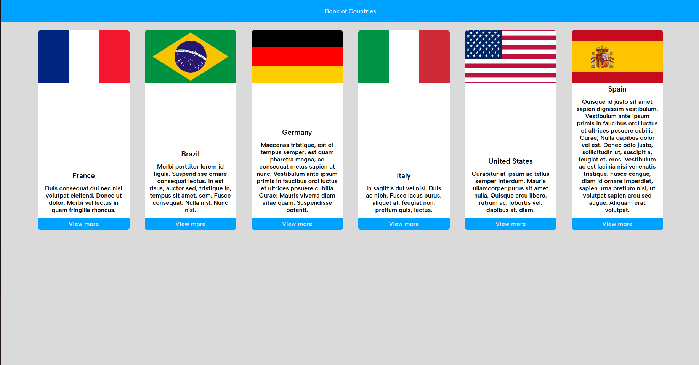

<h1 align="center"> Book of Countries </h1>

  Projeto com o objetivo de pôr em prática habilidades de Javascript e Typescript.

  <a href="#tecnologies">Tecnologias</a>&nbsp;&nbsp;&nbsp;|&nbsp;&nbsp;&nbsp;
  <a href="#project">Projeto</a>&nbsp;&nbsp;&nbsp;|&nbsp;&nbsp;&nbsp;
    <a href="#orientations">Orientações</a>&nbsp;&nbsp;&nbsp;|&nbsp;&nbsp;&nbsp;
  <a href="#challenges">Desafios</a>&nbsp;&nbsp;&nbsp;|&nbsp;&nbsp;&nbsp;
  <a href="#extres">Extras</a>&nbsp;&nbsp;&nbsp;|&nbsp;&nbsp;&nbsp;
  <a href="#memo-licença">Licença</a>

  

 

  

## 🚀 Tecnologias

 Esse projeto foi desenvolvido com as seguintes tecnologias: 

- HTML e CSS;
- TS (Typescript);
- Docker;
- Vite;

## 💻 Projeto

 "Book of Countries" é um projeto sobre informações de alguns países, o propósito deste projeto foi melhorar minhas habilidades em Javascript e Typescript (atualmente).

## 🗺️ Orientações

 
Você só precisa ter o Docker instalado em sua máquina e executar o seguinte comando: docker compose up -d, o "Docker Host" é responsável por instalar as dependências com o NPM e consequetemente executar o projeto.

## ⚔️ Desafios enfrentados

 Não tive tantas dificuldades para realizar a atualização do projeto para Vite, Typescript e Docker devido a baixa complexidade do mesmo. 

## 🧑‍🔧 Extras

 
  Quer um desafio? Atualize o projeto com um layout mais profissional.

## :memo: Licença

Esse projeto está sob a licença MIT.